# Taller Python Intermedio - Manejo de Excepciones

## Explicación breve sobre qué son las excepciones

Las excepciones son errores que ocurren durante la ejecución de un programa en Python.

El manejo de excepciones permite controlar esos errores para evitar que el programa se cierre de manera inesperada. Gracias a esto, los programas pueden seguir funcionando correctamente y mostrar mensajes más claros al usuario.

---

# Diferencia entre except, else y finally

## except

El bloque `except` se ejecuta cuando ocurre un error dentro del bloque `try`.

## else

El bloque `else` se ejecuta únicamente cuando no ocurre ningún error.

## finally

El bloque `finally` se ejecuta siempre, ocurra o no una excepción.

---

# Capturas de ejecución del reto

## Ejemplo 1

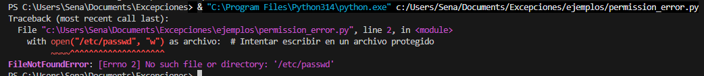

---

## Ejemplo 2

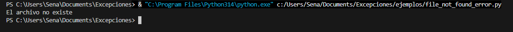

---

## Ejemplo 3

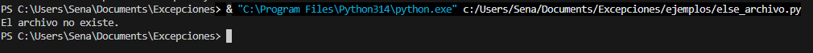

---

## Ejemplo 4

---

## Ejemplo 5

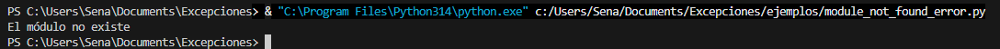

---

## Ejemplo 6

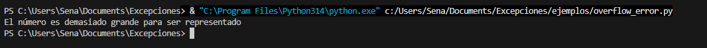

---

## Ejemplo 7

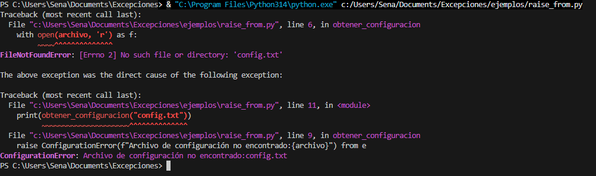

---

## Ejemplo 8

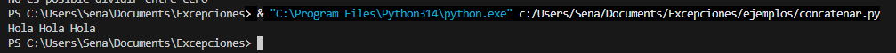

---

## Ejemplo 9

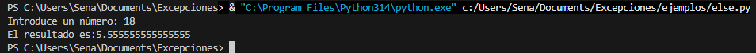

---

## Ejemplo 10

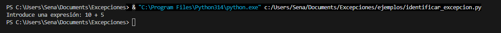

---

## Ejemplo 11

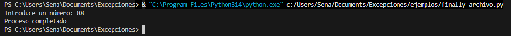

---

## Ejemplo 12

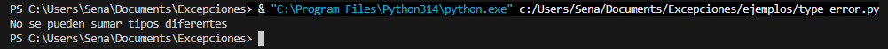

---

## Ejemplo 13

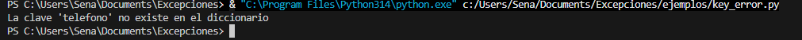

---

## Ejemplo 14

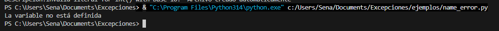

---

## Ejemplo 15

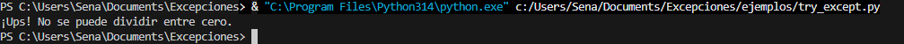

---

## Ejemplo 16

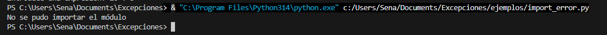

---

## Ejemplo 17

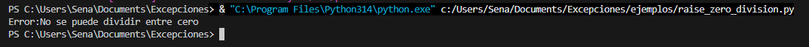

---

## Ejemplo 18

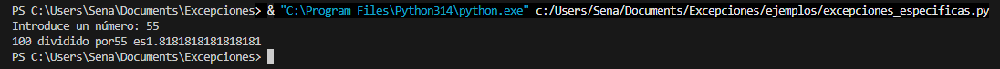

---

## Ejemplo 19

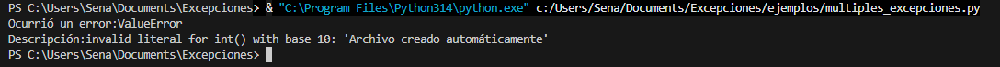

---

## Ejemplo 20

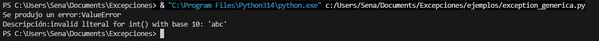

---

## Ejemplo 21

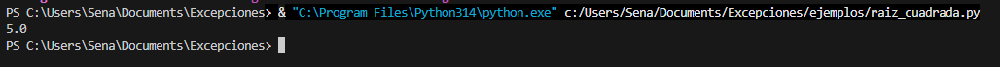

---

## Ejemplo 22

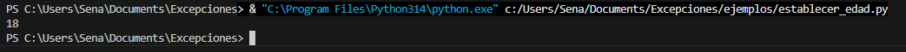

---

## Ejemplo 23

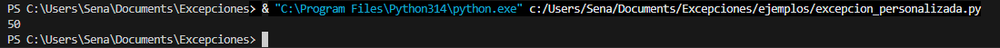

---

## Ejemplo 24

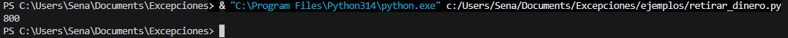

---

## Ejemplo 25

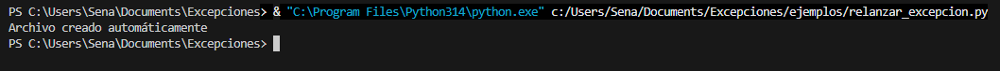

---

## Ejemplo 26

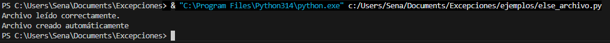

---

## Ejemplo 27

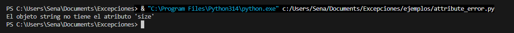

---

## Ejemplo 28

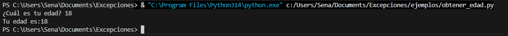

---

## Ejemplo 29

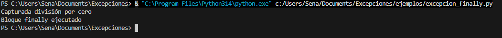

---

## Ejemplo 30

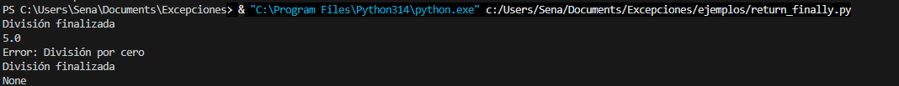

---

## Ejemplo 31

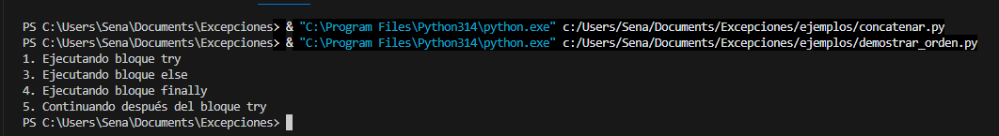

---

## Reto

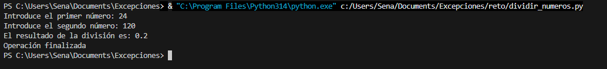

---

# Reflexión personal sobre la importancia del manejo de errores

El manejo de errores es importante porque ayuda a que los programas sean más seguros y estables.

Gracias a las excepciones, es posible controlar situaciones inesperadas sin que el programa termine de forma abrupta. Además, permite mostrar mensajes más claros al usuario y facilita la corrección de errores durante el desarrollo del programa.

Aprender a manejar excepciones ayuda a crear programas más organizados, confiables y fáciles de mantener.